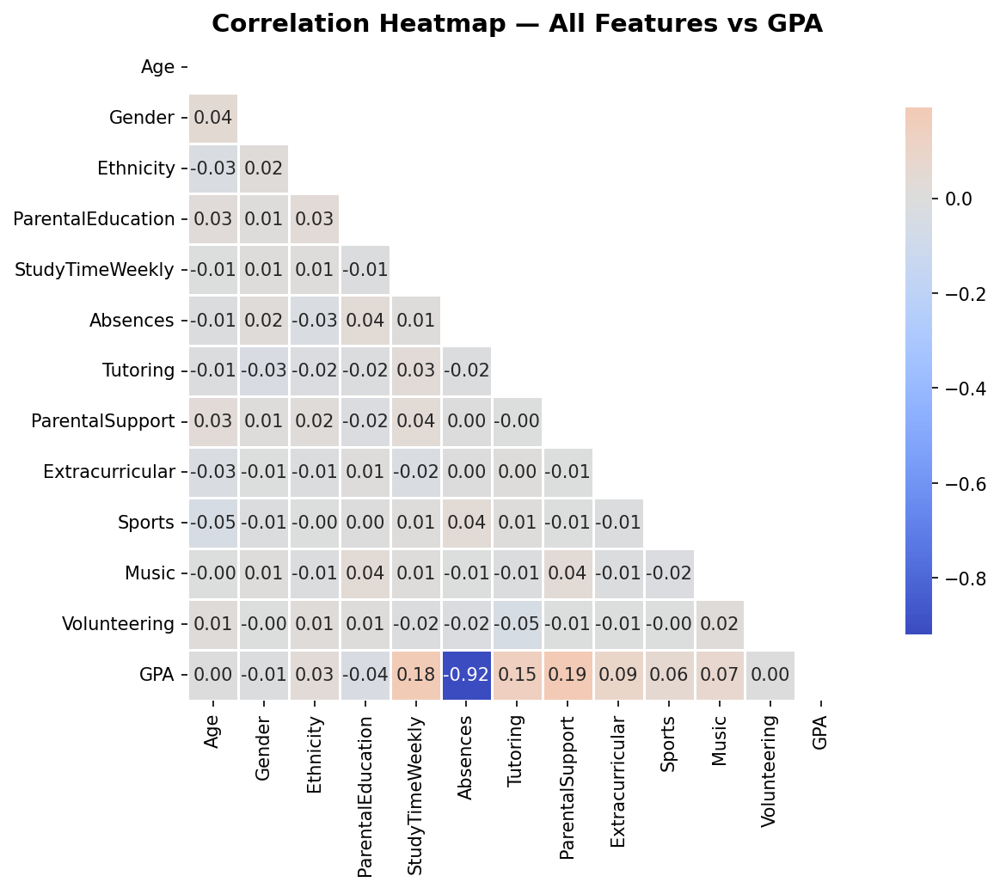
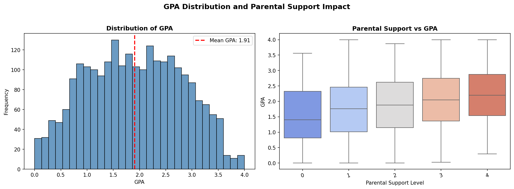
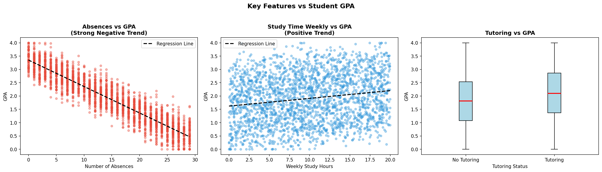
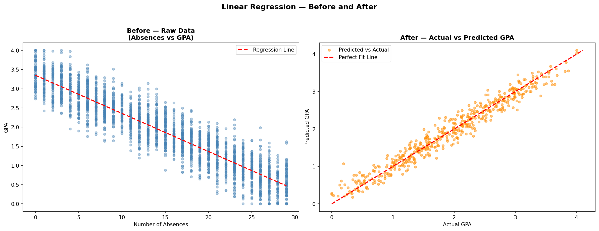
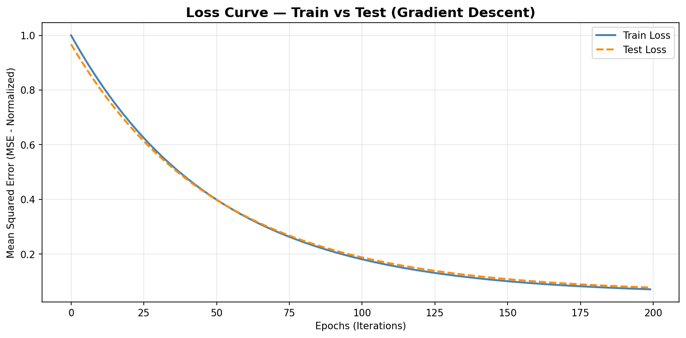

# Student GPA Prediction Model

## Mission & Problem
Schools in Rwanda and across Africa lack data-driven tools to identify students at risk of poor academic performance before it is too late to intervene. This project builds a regression model that predicts a student's GPA from study habits, attendance, parental support, and extracurricular activities — enabling educators to flag struggling students early and provide targeted support before performance deteriorates.

## Dataset
- **Name:** Students Performance Dataset
- **Source:** [Kaggle – Rabie El Kharoua](https://www.kaggle.com/datasets/rabieelkharoua/students-performance-dataset)
- **Size:** 2,392 student records × 15 features (rich in volume and variety)
- **Target:** GPA (0.0 – 4.0 continuous scale)
- **Features:** Age, Gender, Ethnicity, ParentalEducation, StudyTimeWeekly, Absences, Tutoring, ParentalSupport, Extracurricular, Sports, Music, Volunteering

---

## Visualizations

### 1. Correlation Heatmap
Shows the relationship between all features and GPA. Absences has the strongest negative correlation (−0.92) while StudyTimeWeekly and Tutoring show strong positive correlations.



### 2. GPA Distribution
Shows the spread of student GPA values across the dataset, confirming a near-normal distribution suitable for regression analysis.



### 3. Feature vs GPA Scatter Plot
Visualises how individual features (especially Absences and StudyTimeWeekly) relate to GPA before and after model fitting.



### 4. Scatter Plot — Before & After Linear Fit
Shows raw data points alongside the fitted regression line, demonstrating how well Linear Regression captures the trend.



### 5. Loss Curve (Train vs Test)
Gradient descent loss curve showing convergence of both training and test loss across iterations.



---

## Model Performance

| Model             | R² Score | MAE    |
|-------------------|----------|--------|
| **Linear Regression** | **0.9534** | **0.1551** |
| Random Forest     | 0.9146   | 0.2342 |
| Decision Tree     | 0.8346   | 0.2792 |

**Best Model: Linear Regression** — saved as `best_model.pkl`
Linear Regression achieves R² = 0.9534, meaning it explains 95.3% of the variance in student GPA. Train R² (0.9542) ≈ Test R² (0.9534), confirming no overfitting. It outperforms both tree-based models on this dataset because the relationship between features and GPA is largely linear.

---

## Project Structure

```
linear_regression_model/
│
├── summative/
│   ├── inear_regression/
│   │   ├── multivariate.ipynb       ← Training notebook
│   │   ├── best_model.pkl           ← Saved best model
│   │   ├── scaler.pkl               ← Fitted StandardScaler
│   │   └── *.png                    ← Visualisation plots
│   │
│   ├── API/
│   │   ├── prediction.py            ← FastAPI app
│   │   └── requirements.txt         ← API dependencies
│   │
│   └── FlutterApp/                  ← Flutter mobile app
│       └── lib/
│           ├── main.dart
│           ├── screens/
│           │   └── prediction_screen.dart
│           └── services/
│               └── prediction_service.dart
│
└── README.md
```

---

## API

### Public Endpoint
> **Base URL:** `https://linear-regression-model-9gg3.onrender.com`

| Route | Method | Description |
|---|---|---|
| `/` | GET | Health check |
| `/health` | GET | Model readiness check |
| `/predict` | POST | Predict student GPA |
| `/retrain` | POST | Retrain with uploaded CSV |
| `/retrain/default` | POST | Retrain with original dataset |

### Swagger UI (Live Docs)
🔗 **[https://linear-regression-model-9gg3.onrender.com/docs](https://linear-regression-model-9gg3.onrender.com/docs)**

### Sample Request Body (`POST /predict`)
```json
{
  "age": 16,
  "gender": "male",
  "study_time_weekly": 15.0,
  "absences": 3,
  "tutoring": "yes",
  "extracurricular": "yes",
  "sports": "no",
  "music": "no",
  "volunteering": "no",
  "ethnicity": "caucasian",
  "parental_education": "some college",
  "parental_support": "high"
}
```

### Sample Response
```json
{
  "predicted_gpa": 3.54
}
```

### CORS Configuration
CORS is configured with explicit (non-wildcard) allowed origins, methods, headers, and credentials — not a generic `allow *`:
```python
allow_origins=["http://localhost:3000", "http://localhost:8080", "https://student-gpa-predictor.onrender.com"],
allow_credentials=True,
allow_methods=["GET", "POST", "PUT", "DELETE", "OPTIONS"],
allow_headers=["Content-Type", "Authorization", "Accept", "X-Requested-With"]
```

### Model Retraining
The API supports two retraining endpoints:
- **`POST /retrain/default`** — retrains all three models on the original Kaggle dataset and saves the best one
- **`POST /retrain`** — accepts a new CSV upload, retrains on it, and saves the best model automatically

---

## Running the API Locally

```bash
cd summative/API
pip install -r requirements.txt
uvicorn prediction:app --reload --host 0.0.0.0 --port 8000
Open http://127.0.0.1:8000/docs
```

---

## Flutter Mobile App

### How to Run

**Prerequisites**
- Flutter SDK ≥ 3.10 installed ([flutter.dev](https://flutter.dev/docs/get-started/install))
- Android emulator, iOS simulator, or a physical device connected

**Steps**
```bash
# 1. Navigate to the Flutter app
cd summative/FlutterApp

# 2. Install dependencies
flutter pub get

 3. Set the API URL in lib/services/prediction_service.dart:
Android emulator  → http://10.0.2.2:8000
iOS simulator     → http://127.0.0.1:8000
Physical device   → http://<your-local-ip>:8000
Render (deployed) → https://linear-regression-model-9gg3.onrender.com

# 4. Run the app
flutter run
```

**App Features**
- 12 input fields matching all API variables
- Popup bottom-sheet selectors for categorical fields (Gender, Sports, Music, etc.)
- **Predict** button triggers the API call
- Result displayed as a gradient popup showing the predicted GPA (0.0–4.0)
- Error popup for validation or connection failures

---

## Video Demo
🎬 **[YouTube Demo Link – add your link here]**

> Demo covers: mobile app predictions, Swagger UI tests, model explanation, loss curves, and answers to deployment questions.

---

## Requirements

**API (`summative/API/requirements.txt`)**
```
fastapi
uvicorn
pydantic
scikit-learn
pandas
numpy
joblib
python-multipart
```

**Notebook**
```
pandas, numpy, matplotlib, seaborn, scikit-learn, joblib
```
